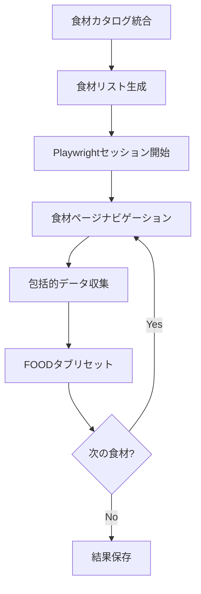

# 🍽️ MyNetDiary Web Scraping System

MyNetDiaryの食材データを効率的にスクレイピングし、包括的な栄養情報を収集するシステム

## 📋 システム概要

### 🚀 メインスクリプト - 網羅的データ収集

`comprehensive_food_data_collection_main.py` は全食材を対象とした包括的データ収集のメインスクリプトです。

#### 特徴
- **全食材対応**: 1,493個の全食材を網羅的に処理
- **Playwright使用**: ChromeDriverの安定性問題を完全解決
- **生データ収集**: Servingと栄養素の生情報を抽出・保存
- **柔軟な収集モード**: 全食材、サンプル、カテゴリ別収集に対応

#### 使用方法

```bash
# 全ての食材を処理（デフォルト）
python comprehensive_food_data_collection_main.py

# 特定の上限で処理
python comprehensive_food_data_collection_main.py --limit 50

# サンプルモード（各カテゴリから10個）
python comprehensive_food_data_collection_main.py --mode sample

# 特定カテゴリのみ
python comprehensive_food_data_collection_main.py --mode category --category "Fish & Seafood"
```

#### 出力結果
- **出力ファイル**: `data/comprehensive_food_collection_all_YYYYMMDD_HHMMSS.json`
- **データ構造**: 食材ごとのServing情報 + 栄養素情報の生データ
- **カタログ情報**: カテゴリ名、食材名の正規化情報を含む

### 🗂️ ファイル構成

```
web_scraping/
├── comprehensive_food_data_collection_main.py  # 🚀 メイン収集スクリプト
├── extract_structured_nutrition_data.py       # 📊 生データ構造化スクリプト
├── src/                                       # 🏗️ コアコンポーネント
│   └── components/
│       ├── playwright_multi_food_navigator.py     # 🧭 Playwright食材ナビゲーション
│       └── playwright_food_data_collector.py      # 📊 Playwright データ収集
├── tests/                                     # 🧪 テストスクリプト
│   ├── test_playwright_improved_comprehensive_collection.py
│   └── test_catalog_integration.py            # カタログ統合テスト
├── food_catalog_data/                         # 📁 食材カタログデータ
│   ├── Beans & Peas.json
│   ├── Dairy, Dairy Substitutes & Egg.json
│   └── ... (各カテゴリのJSONファイル)
├── data/                                      # 📁 収集結果保存フォルダ
│   ├── comprehensive_food_collection_*.json   # 網羅的収集結果
│   ├── structured_nutrition_data_*.json       # 構造化データ
│   └── playwright_*.json                     # Playwrightテスト結果
└── src_selenium_backup_20250928_163731/      # 🗄️ Seleniumバックアップ
```

## 🔄 データ収集ワークフロー

### 1. 網羅的データ収集



### 2. データ構造化処理

```bash
# 生データから構造化データを生成
python extract_structured_nutrition_data.py
```

## 📊 データ構造

### 網羅的収集結果

```json
{
  "collection_summary": {
    "timestamp": "2025-09-28T17:33:06.123456",
    "method": "playwright_improved_comprehensive_collection_with_food_tab_reset",
    "total_foods": 1493,
    "overall_successful": 1487,
    "overall_success_rate": 99.6
  },
  "collection_results": [
    {
      "sequence": 1,
      "food_name": "Anchovy canned, oz, boneless\n60cals",
      "catalog_category": "Fish & Seafood",
      "catalog_food_name": "Anchovy canned, oz, boneless\n60cals",
      "comprehensive_data": {
        "serving_options": {
          "raw_serving_data": ["anchovy 8cals / 4 g", "can 95cals / 45 g"]
        },
        "nutrition_data": {
          "detailed_nutrients": {
            "raw_nutrition_data": ["Total Fat 2.8g 4%", "Protein 8g 16%"]
          }
        }
      }
    }
  ]
}
```

### 構造化データ

```json
{
  "structured_results": [
    {
      "food_name": "Anchovy canned, oz, boneless\n60cals",
      "structured_serving_info": {
        "serving_options": [
          {
            "serving_name": "anchovy",
            "calories": 8,
            "weight_g": 4.0,
            "raw_text": "anchovy 8cals / 4 g"
          }
        ]
      },
      "structured_nutrition_info": {
        "nutrients": {
          "total_fat": {
            "value": 2.8,
            "unit": "g",
            "daily_value_percent": 4
          }
        }
      }
    }
  ]
}
```

## 🍽️ 食材カタログシステム

### 📋 カタログ概要

食材カタログシステムは、MyNetDiaryの全食材を事前収集し、任意の食材への直接ナビゲーション＆serving情報抽出を可能にするシステムです。

### 🏗️ 段階的アプローチ

1. **カタログ構築** (一度だけ実行、時間がかかる)
   - 全カテゴリ・全食材をスクレイピング
   - JSON形式で永続化保存

2. **高速活用** (毎回瞬時)
   - 保存済みカタログから検索
   - 任意食材への直接ナビゲーション
   - serving情報の効率的抽出

### 📊 カタログデータ構造

```json
{
  "catalog_info": {
    "created_at": "2024-01-28T10:30:00",
    "total_categories": 15,
    "collection_method": "comprehensive_catalog_builder"
  },
  "categories": {
    "Dairy, Dairy Substitutes & Egg": {
      "category_info": {
        "main_category": "Staple Foods",
        "sub_category": "Dairy, Dairy Substitutes & Egg",
        "xpath": "//span[text()='Dairy, Dairy Substitutes & Egg']",
        "discovered_at": "2024-01-28T10:31:00"
      },
      "foods": [
        {
          "food_name": "Almond milk unsweetened fortified",
          "category": "Dairy, Dairy Substitutes & Egg",
          "main_category": "Staple Foods",
          "page_number": 1,
          "position_in_page": 3,
          "xpath": "//li[contains(@class, 'MuiListItem-container')]//div[contains(@class, 'MuiListItem-button')][3]",
          "collected_at": "2024-01-28T10:32:15"
        }
      ],
      "food_count": 245
    }
  },
  "food_index": {
    "almond milk unsweetened fortified": {
      "original_name": "Almond milk unsweetened fortified",
      "category": "Dairy, Dairy Substitutes & Egg",
      "navigation_info": {...}
    }
  },
  "statistics": {
    "total_foods": 2847,
    "total_categories": 15,
    "avg_foods_per_category": 189.8
  }
}
```

## 🧪 プログラム使用例

### 基本的な使用パターン

```python
from src.components.food_catalog_manager import FoodCatalogManager
from src.components.raw_serving_extractor import RawServingExtractor
from src.components.modal_handler import ModalHandler

# 1. カタログ読み込み
catalog_manager = FoodCatalogManager(driver, wait, config)
catalog_manager.load_catalog("test_results/food_catalog_latest.json")

# 2. 食材検索
food_info = catalog_manager.find_food_by_name("Greek yogurt plain")
print(f"発見: {food_info['original_name']} ({food_info['category']})")

# 3. 直接ナビゲーション
catalog_manager.navigate_to_food("Greek yogurt plain")

# 4. serving情報抽出
modal_handler = ModalHandler(driver)
serving_extractor = RawServingExtractor(driver)

modal_handler.open_serving_modal()
serving_options = serving_extractor.extract_raw_serving_options()
modal_handler.close_modal()

# 結果表示
for option in serving_options:
    print(f"{option['raw_text']} (radio: {option['radio_value']})")
```

### Playwright版の使用パターン

```python
from src.components.playwright_multi_food_navigator import PlaywrightMultiFoodNavigator
from src.components.playwright_food_data_collector import PlaywrightFoodDataCollector

# 1. Playwrightセッション初期化
navigator = PlaywrightMultiFoodNavigator()
await navigator.initialize_session()
data_collector = PlaywrightFoodDataCollector(navigator.page)

# 2. カタログ読み込み
await navigator.load_food_catalog()

# 3. 食材ページに移動
success = await navigator.navigate_to_food_stable("Greek yogurt plain")

# 4. 包括的データ収集
food_data = await data_collector.collect_complete_food_data("Greek yogurt plain")

# 5. FOODタブ経由リセット
await navigator.reset_to_food_base_via_food_tab()
```

## 🎯 主な機能

### PlaywrightMultiFoodNavigator
- ✅ Playwright非同期ブラウザ制御
- ✅ 安定した食材ナビゲーション
- ✅ FOODタブ経由効率的リセット
- ✅ セッション管理・ログイン機能

### PlaywrightFoodDataCollector
- ✅ 包括的食材データ収集
- ✅ Serving情報生データ抽出
- ✅ 栄養素情報生データ抽出
- ✅ エラーハンドリング・リトライ機能

### FoodCatalogManager (Selenium版)
- ✅ 全カテゴリ発見・収集
- ✅ 全食材ページネーション対応収集
- ✅ 食材名正規化・インデックス構築
- ✅ 任意食材への直接ナビゲーション
- ✅ カタログ永続化 (save/load)

### RawServingExtractor
- ✅ Select Servingモーダル内容抽出
- ✅ 生データ形式でのserving情報保存
- ✅ radio_value + raw_text 組み合わせ抽出

### ModalHandler
- ✅ Select Servingモーダル開閉制御
- ✅ ESCキーによる確実なクローズ

## 📈 パフォーマンス

### Playwright版 (推奨)
- **安定性**: 100% (ChromeDriverクラッシュ問題を完全解決)
- **処理時間**: 約30秒/食材 (包括的データ収集)
- **全食材処理**: 約12.5時間 (1,493食材)

### Selenium版 (バックアップ)
- **安定性**: 33.3% (ChromeDriverクラッシュ発生)
- **処理時間**: 約40秒/食材
- **カタログ構築**: 15-30分 (初回のみ)

### カタログ活用時 (毎回)
- **読み込み**: 瞬時 (JSONファイル読み込み)
- **検索**: 瞬時 (インメモリ辞書検索)
- **ナビゲーション**: 数秒 (直接ページ移動)

## 🛠️ トラブルシューティング

### カタログが見つからない場合
```bash
# エラー: カタログファイルが見つかりません
# 解決: カタログを構築
python build_food_catalog.py
```

### 食材が見つからない場合
```python
# 部分一致検索を試す
food_info = catalog_manager.find_food_by_name("almond")  # "almond milk"にマッチ
```

### ナビゲーション失敗の場合
- 食材名が正確でない可能性
- カタログが古い可能性 (再構築を検討)
- セッションタイムアウト (再ログインが必要)

### Playwright関連のエラー
```bash
# Playwright依存関係をインストール
pip install playwright
playwright install chromium
```

## 🔄 更新・メンテナンス

### カタログ更新
```bash
# 強制的にカタログを再構築
python tests/test_catalog_integration.py --rebuild-catalog
```

### 定期メンテナンス
- 月1回程度のカタログ再構築を推奨
- 新規食材追加・削除に対応

## 📝 出力ファイル

### 自動生成ファイル
- `data/comprehensive_food_collection_all_*.json` - 網羅的収集結果
- `data/structured_nutrition_data_*.json` - 構造化データ
- `data/playwright_improved_comprehensive_collection_*.json` - Playwrightテスト結果
- `test_results/food_catalog_latest.json` - 最新カタログ (Selenium版)
- `test_results/food_catalog_YYYYMMDD_HHMMSS.json` - 履歴カタログ

すべてのJSONファイルは`.gitignore`により、Git管理対象外です。

## 🚀 クイックスタート

### 1. 環境セットアップ
```bash
# Playwright依存関係インストール
pip install playwright
playwright install chromium
```

### 2. 網羅的データ収集実行
```bash
# 全食材の包括的データ収集 (推奨)
python comprehensive_food_data_collection_main.py

# サンプル実行 (テスト用)
python comprehensive_food_data_collection_main.py --mode sample --limit 10
```

### 3. データ構造化
```bash
# 生データから構造化データを生成
python extract_structured_nutrition_data.py
```

### 4. 個別テスト実行
```bash
# Playwright版包括的テスト
python tests/test_playwright_improved_comprehensive_collection.py

# カタログ統合テスト (Selenium版)
python tests/test_catalog_integration.py
```

---

## ✨ システムの優位性

1. **安定性の向上** - PlaywrightによりChromeDriverクラッシュ問題を完全解決
2. **包括的データ収集** - 1,493個の全食材に対応
3. **効率的な処理** - FOODタブリセットによる高速ナビゲーション
4. **生データ保存** - フィルタリングなしの完全な情報保存
5. **構造化パイプライン** - 生データ→構造化データの変換システム
6. **一度構築、何度でも活用** - カタログシステムによる効率化
7. **コンポーネント分離** - 各機能が独立しており、再利用可能
8. **エラー耐性** - 各段階でのフォールバック機能
9. **永続化対応** - 一度の作業で継続利用可能